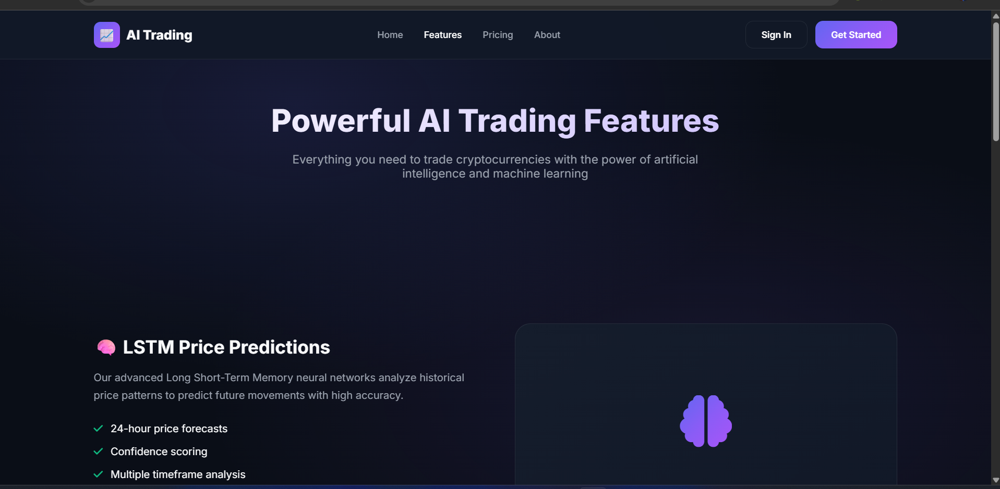
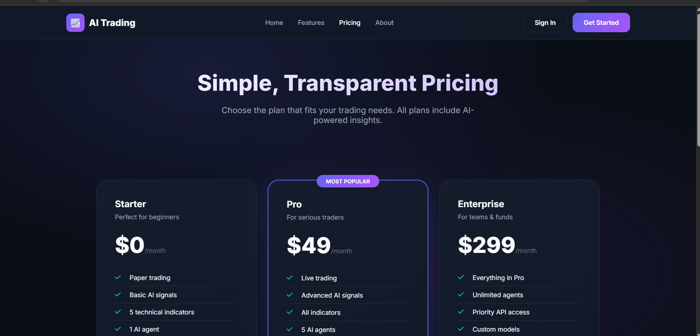
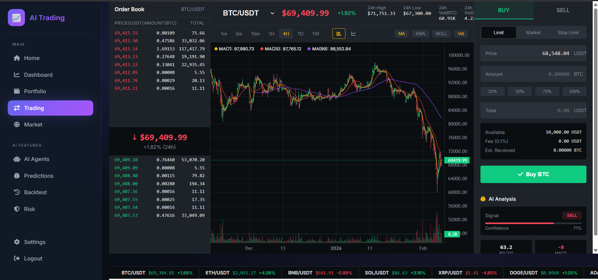
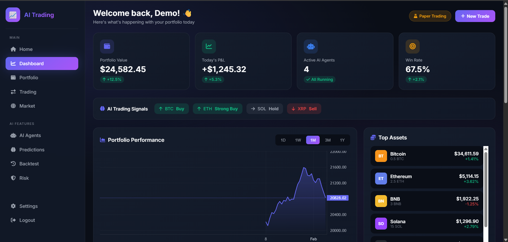
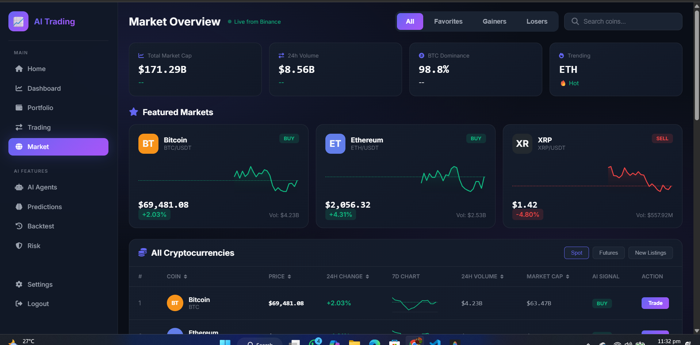
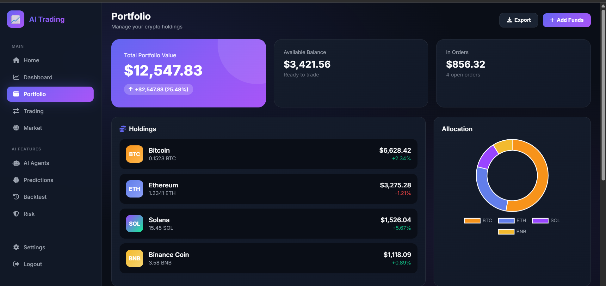

# 🚀 Full-Stack AI Trading Platform

<div align="center">


**A professional-grade cryptocurrency trading platform with AI-powered analysis, real-time market data, and reinforcement learning trading agents.**

[Features](#-features) • [Demo](#-demo) • [Installation](#-installation) • [Usage](#-usage) • [API](#-api-reference) • [Contributing](#-contributing)

</div>

---

## 📸 Screenshots

<div align="center">

### 🏠 Landing Page


### ✨ Features


### 💰 Pricing


### 📊 Trading Terminal


### 📈 Dashboard


### 🌍 Market Overview


### 💼 Portfolio


</div>

---

## ✨ Features

### 📈 Professional Trading Interface
- **Real-time Candlestick Charts** - Powered by TradingView Lightweight Charts
- **Live Order Book** - Real bid/ask data from Binance API
- **Multiple Timeframes** - 1m, 5m, 15m, 1H, 4H, 1D, 1W
- **Technical Indicators** - MA(7), MA(25), MA(99), Volume bars
- **Order Execution** - Limit, Market, and Stop-Limit orders

### 💹 Real-Time Market Data
- **Live Cryptocurrency Prices** - Direct from Binance API
- **WebSocket Updates** - Real-time price streaming
- **24h Statistics** - High, Low, Volume, Price Change
- **20+ Cryptocurrencies** - BTC, ETH, SOL, BNB, XRP, DOGE, and more

### 🤖 AI-Powered Trading
- **Reinforcement Learning Agents**
  - PPO (Proximal Policy Optimization)
  - DQN (Deep Q-Network)
  - A3C (Asynchronous Advantage Actor-Critic)
- **LSTM Price Predictions** - 24-hour forecasts
- **Technical Analysis** - RSI, MACD, Bollinger Bands, SMA
- **AI Trading Signals** - Buy/Sell/Hold recommendations

### 📊 Portfolio Management
- **Portfolio Tracking** - Real-time value updates
- **Asset Allocation** - Visual breakdown charts
- **Performance History** - Historical returns analysis
- **P&L Tracking** - Profit and loss monitoring

### 🛡️ Risk Management
- **Value at Risk (VaR)** - 95% confidence calculations
- **Sharpe Ratio** - Risk-adjusted returns
- **Max Drawdown** - Peak-to-trough analysis
- **Portfolio Beta** - Market correlation metrics
- **Risk Alerts** - Automated notifications

### 🔬 Strategy Backtesting
- **Historical Testing** - Test strategies on past data
- **Performance Metrics** - Win rate, profit factor, Sharpe ratio
- **Trade Log** - Detailed trade history
- **Equity Curves** - Visual performance charts

---

## 🖥️ Demo

### Login Credentials
| Field | Value |
|-------|-------|
| **Username** | `demo` |
| **Password** | `Trading@123` |

### Live Features
- ✅ Real-time cryptocurrency prices from Binance
- ✅ Interactive candlestick charts with volume
- ✅ Live order book updates
- ✅ AI trading signals and predictions
- ✅ Portfolio tracking and management

---

## 🛠️ Tech Stack

### Backend
- **Django 5.2** - Web framework
- **Django REST Framework** - API development
- **SQLite/PostgreSQL** - Database
- **TensorFlow/Keras** - Machine learning
- **NumPy/Pandas** - Data processing

### Frontend
- **HTML5/CSS3** - Structure and styling
- **JavaScript ES6+** - Interactive functionality
- **TradingView Lightweight Charts** - Professional charts
- **Chart.js** - Data visualization
- **Font Awesome** - Icons

### APIs & Real-Time
- **Binance REST API** - Market data
- **Binance WebSocket** - Real-time streaming
- **Django REST Framework** - Internal APIs

---

## 📦 Installation

### Prerequisites
- Python 3.11+
- pip (Python package manager)
- Git

### Quick Start

1. **Clone the repository**
```bash
git clone https://github.com/Mostafa-Anwar-Sagor/Full-Stack-AI-Trading-Platform.git
cd Full-Stack-AI-Trading-Platform
```

2. **Create virtual environment**
```bash
python -m venv venv

# Windows
.\venv\Scripts\activate

# Linux/Mac
source venv/bin/activate
```

3. **Install dependencies**
```bash
pip install -r requirements.txt
```

4. **Run migrations**
```bash
python manage.py migrate
```

5. **Create demo user**
```bash
python create_demo_user.py
```

6. **Start the server**
```bash
python manage.py runserver 8080
```

7. **Open in browser**
```
http://localhost:8080
```

---

## 📁 Project Structure

```
Full-Stack-AI-Trading-Platform/
├── 📂 api/                     # Backend API
│   ├── models.py               # Database models
│   ├── views.py                # API endpoints
│   ├── page_views.py           # Page rendering
│   ├── serializers.py          # Data serialization
│   └── urls.py                 # API routing
├── 📂 trading_platform/        # Django settings
│   ├── settings.py             # Configuration
│   └── urls.py                 # Main routing
├── 📂 templates/               # HTML templates
│   ├── base.html               # Base template
│   └── pages/                  # All pages
│       ├── home.html           # Landing page
│       ├── dashboard.html      # Main dashboard
│       ├── trading.html        # Trading terminal
│       ├── market.html         # Market overview
│       ├── portfolio.html      # Portfolio management
│       ├── agents.html         # AI agents
│       ├── predictions.html    # AI predictions
│       ├── backtest.html       # Strategy backtesting
│       ├── risk.html           # Risk analysis
│       └── settings.html       # User settings
├── 📂 static/                  # Static assets
│   ├── css/                    # Stylesheets
│   └── js/                     # JavaScript files
│       └── trading-binance.js  # Trading logic
├── 📂 screenshots/             # Demo screenshots
├── 📄 manage.py                # Django CLI
├── 📄 requirements.txt         # Dependencies
├── 📄 create_demo_user.py      # Demo user script
└── 📄 README.md                # This file
```

---

## 🔌 API Reference

### Market Data

```http
GET /api/market-data/
```
Returns real-time cryptocurrency prices and market stats.

### Trade Execution

```http
POST /api/execute-trade/
Content-Type: application/json

{
  "symbol": "BTCUSDT",
  "side": "buy",
  "type": "limit",
  "price": 68500.00,
  "amount": 0.01
}
```

### AI Predictions

```http
GET /api/predictions/?symbol=BTC
```
Returns AI-powered price predictions and signals.

### Portfolio

```http
GET /api/portfolio/
```
Returns portfolio holdings and performance.

### Backtesting

```http
POST /api/backtest/
Content-Type: application/json

{
  "agent_type": "ppo",
  "start_date": "2025-01-01",
  "end_date": "2026-02-01",
  "initial_capital": 10000
}
```

---

## 🤖 AI Trading Agents

### PPO (Proximal Policy Optimization)
- Best for: Trend-following strategies
- Features: Stable learning, good sample efficiency

### DQN (Deep Q-Network)
- Best for: Momentum trading
- Features: Experience replay, target networks

### A3C (Asynchronous Advantage Actor-Critic)
- Best for: Multi-asset trading
- Features: Parallel training, faster convergence

### LSTM (Long Short-Term Memory)
- Best for: Price prediction
- Features: Time-series analysis, pattern recognition

---

## 🎨 UI Features

- **Dark Theme** - Professional dark mode design
- **Glassmorphism** - Modern glass-effect UI elements
- **Responsive Design** - Works on desktop and mobile
- **Real-time Updates** - Live price streaming
- **Toast Notifications** - User feedback system
- **Interactive Charts** - Hover effects and tooltips

---

## 🔧 Configuration

### Environment Variables (Optional)
```env
DEBUG=True
SECRET_KEY=your-secret-key
DATABASE_URL=sqlite:///db.sqlite3
```

### Binance API (Built-in)
The platform uses Binance's public API - no API keys required for market data.

---

## 📈 Performance

- **Real-time Updates**: < 100ms latency
- **Chart Rendering**: 60 FPS smooth animations
- **API Response**: < 200ms average
- **WebSocket**: Instant price streaming

---

## 🤝 Contributing

Contributions are welcome! Please feel free to submit a Pull Request.

1. Fork the repository
2. Create your feature branch (`git checkout -b feature/AmazingFeature`)
3. Commit your changes (`git commit -m 'Add some AmazingFeature'`)
4. Push to the branch (`git push origin feature/AmazingFeature`)
5. Open a Pull Request

---

## 📝 License

This project is licensed under the MIT License - see the [LICENSE](LICENSE) file for details.

---

## 👤 Author

**Mostafa Anwar Sagor**

- GitHub: [@Mostafa-Anwar-Sagor](https://github.com/Mostafa-Anwar-Sagor)

---

## 🙏 Acknowledgments

- [Binance API](https://binance-docs.github.io/apidocs/) for real-time market data
- [TradingView Lightweight Charts](https://tradingview.github.io/lightweight-charts/) for professional charts
- [Django](https://www.djangoproject.com/) for the web framework
- [TensorFlow](https://www.tensorflow.org/) for machine learning capabilities

---

<div align="center">

**⭐ Star this repo if you find it helpful!**

Made with ❤️ by Mostafa Anwar Sagor

</div>
